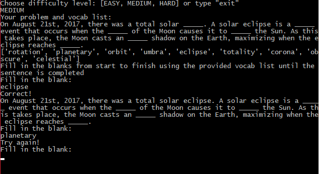

# Vocab Fill in the Blank Quiz

## About:
This file was written for my Vocab Quiz Project for a Udacity Intro to Programming class. When run, the code asks the user to choose a difficulty and then begins the quiz.
This is my first project done using Python, so there are likely ways to make the code a little more concise and efficient. Regardless, I learned a lot about Python and problem solving through this project.

## Instructions:
Run the *quiz.py* file. Choose a difficulty by typing either "EASY", "MEDIUM", or "HARD" when prompted. Then use the words from the provided vocab list to fill in the blanks from start to finish, one at a time. When complete, the program will ask whether to play again or exit. All inputs are CASE SENSITIVE.

## Dependencies:
This quiz is run on Python 2.7.
* Python 2.7: https://www.python.org/downloads/release/python-2714/

## Notes:
There are only three static quizzes, each difficulty has one quiz.
